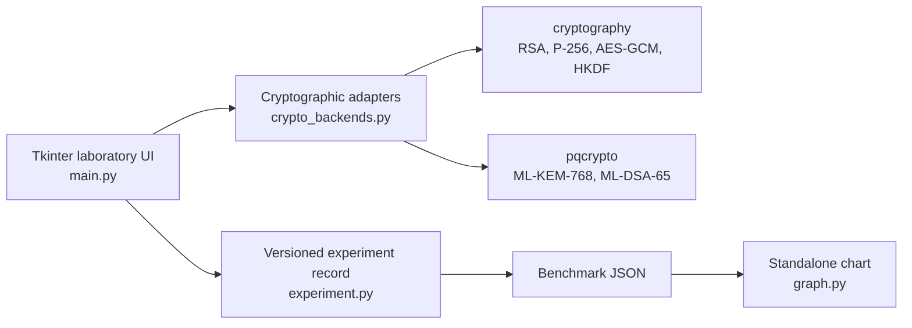

# CipherShield: Classical and Post-Quantum Cryptography Laboratory

[](https://github.com/karamjotsinghbusiness-web/Quantum-Encryption-using-NIST-Kyber-and-others/actions/workflows/ci.yml)
[](https://github.com/karamjotsinghbusiness-web/Quantum-Encryption-using-NIST-Kyber-and-others/actions/workflows/codeql.yml)
[](https://github.com/karamjotsinghbusiness-web/Quantum-Encryption-using-NIST-Kyber-and-others/releases/latest)
[](https://www.python.org/downloads/)

CipherShield is an educational desktop laboratory for comparing classical and
post-quantum public-key cryptography in one Python application. It implements
authenticated hybrid encryption, digital signatures, tamper-detection tests,
and an exploratory benchmark that exports self-describing JSON records.

**Start here:** follow the [60-second demonstration](docs/demo.md), inspect the
[architecture](docs/architecture.md), or download the
[latest source release](https://github.com/karamjotsinghbusiness-web/Quantum-Encryption-using-NIST-Kyber-and-others/releases/latest).

The project is built around two questions:

1. How do classical and NIST-standardized post-quantum primitives differ in
   key-generation time and output size in the same software environment?
2. How should key-encapsulation and signature primitives be composed and
   described without pretending that a KEM encrypts arbitrary files or that a
   signature algorithm provides encryption?

> [!IMPORTANT]
> This is a learning and experimentation tool. It is not an antivirus, a
> production cryptosystem, a FIPS-validated module, or evidence that the
> included implementations are secure against every attack. The repository
> does not present a novel cryptographic algorithm or a peer-reviewed result.

## Implemented primitives

| Purpose | Construction | Quantum status represented by the lab |
|---|---|---|
| Encryption | RSA-2048 OAEP wrapping an AES-256-GCM key | Vulnerable to a sufficiently capable fault-tolerant quantum computer |
| Encryption | Ephemeral P-256 ECDH + HKDF-SHA-256 + AES-256-GCM | Vulnerable to a sufficiently capable fault-tolerant quantum computer |
| Key establishment + encryption | ML-KEM-768 + HKDF-SHA-256 + AES-256-GCM | Designed for post-quantum security |
| Signature | RSA-PSS-2048 with SHA-256 | Vulnerable to a sufficiently capable fault-tolerant quantum computer |
| Signature | ECDSA P-256 with SHA-256 | Vulnerable to a sufficiently capable fault-tolerant quantum computer |
| Signature | ML-DSA-65 | Designed for post-quantum security |

The interface sometimes includes the historical names **Kyber** and
**Dilithium** to connect the standardized algorithms with their predecessors.
The standardized names are ML-KEM and ML-DSA. ML-KEM is a key-encapsulation
mechanism, so CipherShield derives a symmetric key and uses AES-GCM for the
message. ML-DSA is used only for signatures.

## Quick start

Prerequisites:

- Python 3.10 or newer
- Tk support for the desktop interface
- A platform supported by the pinned `pqcrypto` distribution

```bash
git clone https://github.com/karamjotsinghbusiness-web/Quantum-Encryption-using-NIST-Kyber-and-others.git
cd Quantum-Encryption-using-NIST-Kyber-and-others
python3 -m venv .venv
source .venv/bin/activate          # Windows: .venv\Scripts\activate
python -m pip install --upgrade pip
python -m pip install -r requirements.txt
python main.py
```

The application opens a local Tkinter interface. No account, network service,
API key, or real sensitive data is required.

On Debian or Ubuntu, install Tk separately if necessary:

```bash
sudo apt-get install python3-tk
```

## Verify the implementation

The automated suite checks classical and post-quantum round trips, rejects
modified authenticated ciphertexts, detects signed-message modification, and
checks benchmark-record metadata.

```bash
python -m unittest discover -s tests -v
python -m compileall -q main.py crypto_backends.py experiment.py graph.py
```

Tests that require `pqcrypto` are explicitly skipped when that optional backend
is unavailable. A passing suite is functional evidence, not a security proof or
standards-conformance certification.

## System structure



See [Architecture](docs/architecture.md) for the trust boundaries and data
flow.

## Demonstration

The [guided demonstration](docs/demo.md) walks through classical and
post-quantum encryption, signature verification, deliberate tampering, and a
reproducible benchmark export. It uses synthetic text only and explains what
each result does—and does not—prove.

## Experiments and benchmark interpretation

The Benchmark & Compare tab measures wall-clock time with
`time.perf_counter()`. Its JSON export records the UTC timestamp, iteration
count, Python version, operating system, and dependency versions. Generate a
standalone figure with:

```bash
python graph.py benchmark_results.json
```

These measurements are exploratory. The current GUI reports arithmetic means,
does not isolate the CPU, and does not report dispersion or confidence
intervals. Encryption and signature rows also measure different operations, so
they must not be ranked as if they were interchangeable. Read the
[experimental methodology and limitations](docs/methodology.md) before using a
chart in a report.

## Threat model and non-goals

CipherShield demonstrates correct use of library-level primitives under the
assumption that the operating system, random-number generator, Python runtime,
and dependencies are trustworthy. Authenticated-encryption tests cover
accidental or adversarial ciphertext modification, and signature tests cover
message modification.

The project does **not** address:

- side-channel, fault-injection, memory-extraction, or supply-chain attacks;
- secure long-term private-key storage, key rotation, or identity binding;
- network protocols, certificate validation, multi-user access, or replay;
- formal verification, official known-answer testing, or ACVP validation;
- malware scanning, endpoint protection, or automated incident response;
- production hardening or regulatory compliance.

## Repository map

```text
.
├── main.py                  # Desktop interface and exploratory benchmark
├── crypto_backends.py       # Classical and post-quantum adapters
├── experiment.py            # Versioned benchmark-export metadata
├── graph.py                 # Standalone benchmark visualization
├── tests/                   # Functional and tamper-detection tests
├── docs/
│   ├── architecture.md      # Components, dependencies, and trust boundaries
│   └── methodology.md       # Measurement protocol and limitations
├── .github/workflows/ci.yml # Automated verification
├── CITATION.cff             # Citation metadata
├── CONTRIBUTING.md
└── SECURITY.md
```

## Responsible claims

Appropriate wording for this repository:

- “The tests demonstrate encrypt/decrypt and sign/verify functionality for the
  tested inputs and dependency versions.”
- “ML-KEM and ML-DSA are standardized in NIST FIPS 203 and FIPS 204.”
- “The local benchmark measured these values on this recorded environment.”

Unsupported wording:

- “CipherShield is unbreakable,” “military grade,” or “quantum proof.”
- “The application is FIPS validated.”
- “The benchmark proves one algorithm is universally better.”
- “The threat simulator performs a real quantum attack.”

## References

- NIST, [FIPS 203: Module-Lattice-Based Key-Encapsulation Mechanism Standard](https://doi.org/10.6028/NIST.FIPS.203), 2024.
- NIST, [FIPS 204: Module-Lattice-Based Digital Signature Standard](https://doi.org/10.6028/NIST.FIPS.204), 2024.
- NIST, [Post-Quantum Cryptography project](https://csrc.nist.gov/projects/post-quantum-cryptography).
- `cryptography`, [hazardous-materials cryptographic primitives](https://cryptography.io/en/latest/hazmat/primitives/).
- `pqcrypto`, [Python post-quantum cryptography bindings](https://github.com/backbone-hq/pqcrypto).

## Contributing, security, and citation

See [CONTRIBUTING.md](CONTRIBUTING.md) before proposing a change. Report
security concerns according to [SECURITY.md](SECURITY.md). Cite the software
using the repository's [CITATION.cff](CITATION.cff).

No open-source license has been granted. The source is publicly visible, but
reuse and redistribution rights are reserved unless the owner adds a license.
